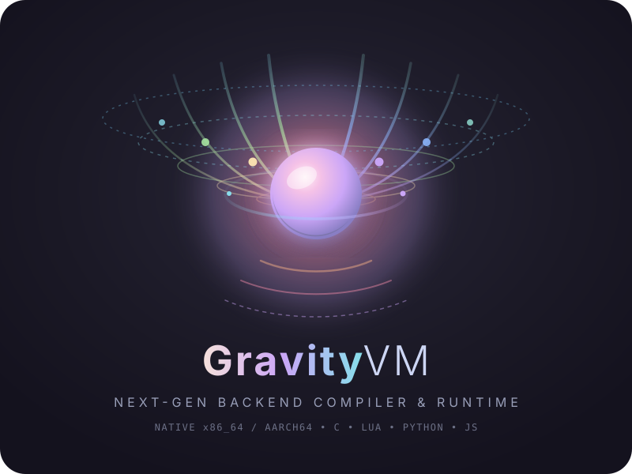

<p align="center">
  
</p>

<p align="center">
  <strong>Universal Bring-Your-Own-Backend (BYOB) Bytecode Compiler &amp; Multi-Target Runtime</strong>
</p>

<p align="center">
  <a href="#supported-targets"></a>
  <a href="#byob-compiler-platform"></a>
  <a href="#caching-engine"></a>
  <a href="LICENSE"></a>
</p>

---

## Overview

**GravityVM (GVM)** is a high-performance **Bring-Your-Own-Backend (BYOB)** compiler platform and intermediate virtual machine. While originally designed alongside the Newton programming language, GravityVM is fully decoupled and can serve as the backend for **any** custom programming language compiler.

GravityVM consumes structured, compact bytecode (`.gvt`) and compiles it directly into native machine code (x86_64, AArch64) or transpiles it into clean, standalone scripts across multiple ecosystem targets (C, Lua, Python, JavaScript).

### Key Features
- **BYOB (Bring-Your-Own-Backend) Architecture**: Write a compiler frontend in any language that emits `.gvt` bytecode, and immediately target native machine code or script engines.
- **Native Assembly Code Generation**: Direct assembly generation with GNU `as`/`ld` and LLVM `clang`.
- **4 Production Transpilation Backends**:
  - **C Target** (`-b:c`): Standard C code with SysV AMD64 register calling convention.
  - **Lua Target** (`-b:lua`): Standalone Lua 5.4 script with native unstructured `goto` and return trampolines.
  - **Python Target** (`-b:python`): Zero-overhead CFG state machine (`while pc is not None:`).
  - **JavaScript Target** (`-b:javascript`): Fast V8 / Node.js switch-case state machine.
- **SHA-256 Incremental Cache Engine**: Sub-millisecond recompilation checks with automatic dependency hashing.
- **Tagged Integer & Heap Value Model**: Unboxed 63-bit integer representations for fast arithmetic without garbage collection overhead.

---

## The BYOB Model: Runtime Libraries Explained

> [!IMPORTANT]
> **GravityVM Does NOT Ship With `libnewton.o`**:
> When compiling to native machine code (`-b:native`) or C (`-b:c`), GravityVM generates raw assembly and object code that references primitive runtime procedures (e.g. arithmetic, collection access).
> 
> - **Newton Language**: Programs compiled from Newton link against Newton's runtime library via `-l:path/to/libnewton.o`.
> - **Custom Language Compilers**: When targeting GravityVM with your own language, **you bring your own runtime backend library** (compiled to `.o` or `.a` from C, Rust, Nim, etc.) and pass it via `-l:my_runtime.o`.
> - **Script Transpilation Targets (Lua, Python, JS)**: Do **not** require any external object file. GravityVM automatically embeds a complete, self-contained runtime environment directly into the generated script!

For a full step-by-step guide on writing a compiler frontend targeting GravityVM, see the [**BYOB Compiler Guide (`docs/byob_compiler_guide.md`)**](docs/byob_compiler_guide.md).

---

## Supported Targets

| Backend Target | CLI Flag | Status | Output Format | Runtime Requirements |
|---|---|---|---|---|
| **Native x86_64** | `-b:native` (default) | Production | ELF / Mach-O / PE Binary | GNU `as` + `ld` or `clang` (+ optional `-l:runtime.o`) |
| **Native AArch64** | `-b:native -arch:aarch64` | Production | ARM64 Binary | `clang -target aarch64-linux-gnu` (+ optional `-l:runtime.o`) |
| **C Source** | `-b:c` | Production | Native Binary / `.c` source | Clang or GCC (+ optional `-l:runtime.o`) |
| **Lua Script** | `-b:lua` | Production | Standalone `.lua` script | Lua 5.4+ or LuaJIT (Self-contained) |
| **Python Script** | `-b:python` / `-b:py` | Production | Standalone `.py` script | Python 3.8+ (Self-contained) |
| **JavaScript** | `-b:javascript` / `-b:js` | Production | Standalone `.js` script | Node.js 16+, Bun, or Deno (Self-contained) |

---

## Quick Start

### 1. Building the GravityVM Binary
GravityVM is written in Nim. Build and install the `gvm` executable:
```bash
make build
```
This compiles `gvm` in release mode and installs it to `~/.local/bin/gvm`.

### 2. Compiling and Running Bytecode

#### Compile to Native Executable:
```bash
# Provide your language runtime object via -l: (e.g. libnewton.o or my_runtime.o)
./gvm build -i:main.gvt -l:path/to/runtime.o -o:main
./main
```

#### Transpile and Run via C:
```bash
./gvm build -b:c -i:main.gvt -l:path/to/runtime.o -o:main_c
./main_c
```

#### Transpile and Run via Lua (Self-Contained):
```bash
./gvm build -b:lua -i:main.gvt -o:main.lua
lua main.lua
```

#### Transpile and Run via Python (Self-Contained):
```bash
./gvm build -b:python -i:main.gvt -o:main.py
python3 main.py
```

#### Transpile and Run via JavaScript (Self-Contained):
```bash
./gvm build -b:javascript -i:main.gvt -o:main.js
node main.js
```

---

## Adding Your Own Backend Target

GravityVM makes it remarkably easy to add new compilation and transpilation backends (such as Go, Ruby, Rust, or WebAssembly).

See the step-by-step walkthrough in [**`codegen/targets/transpiler/Languages.md`**](codegen/targets/transpiler/Languages.md) and check out the scaffold templates in [**`codegen/targets/transpiler/template/`**](codegen/targets/transpiler/template/).

---

## Verification & Test Suite

Run the full end-to-end regression test suite:
```bash
make build-test
```

To test all 4 transpilation backends concurrently on a bytecode file:
```bash
# Clean cache and test each backend
./gvm clean-cache && ./gvm build -b:c -i:main.gvt -l:/home/healing/.newton/lib/libnewton.o -o:test_c && ./test_c
./gvm clean-cache && ./gvm build -b:lua -i:main.gvt -o:test_lua.lua && lua test_lua.lua
./gvm clean-cache && ./gvm build -b:python -i:main.gvt -o:test_py.py && python3 test_py.py
./gvm clean-cache && ./gvm build -b:javascript -i:main.gvt -o:test_js.js
```

---

## Documentation

- [**BYOB Compiler Guide (`docs/byob_compiler_guide.md`)**](docs/byob_compiler_guide.md): How to build a custom compiler frontend targeting GravityVM, including full Python and Nim bytecode emitter snippets.
- [**Adding Language Support (`codegen/targets/transpiler/Languages.md`)**](codegen/targets/transpiler/Languages.md): How to add custom transpilation targets to GravityVM.
- [**Virtual Machine Architecture (`docs/architecture.md`)**](docs/architecture.md): ISA specification, binary container format, memory pools, tagged pointers, and calling conventions.
- [**CLI Command & Flag Reference (`docs/cli_reference.md`)**](docs/cli_reference.md): Detailed explanation of all commands (`build`, `run`, `generate-object`, `clean-cache`, `disassemble`) and options.
- [**Transpiler Subsystems (`docs/transpilers.md`)**](docs/transpilers.md): Deep-dive into C, Lua, Python, and JavaScript code generation, CFG linearization, and runtime library implementation.

---

## License

This project is licensed under the MIT License.
